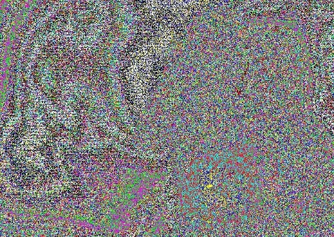

# UMDCTF 2020 Colors Writeup

Writeup to UMD's Colors CTF Challenge

## Challenge

## **Colors**

There is art in steganography. Other times, it's not what you think!

**Author:** [matt2r](https://github.com/MattRisley)

[colors.jpg](colors.jpg)


## Solution

First inspect the image




Since this is a steganography problem first choice could be `steghide`

1. Install `steghide`
    ```bash
    sudo apt-get install steghide
    ```
2. While tring to extract a file we're prompted for a passphrase not provide. Trying no passphrase does NOT work.

    ```bash
    steghide extract -sf colors.jpg 
    #Enter passphrase:
    ```
3. Using a dictionary brute force attack on the passphase might do the trick
    * Downloading a Steghide Brute Force Tool

    ```bash
    git clone https://github.com/Va5c0/Steghide-Brute-Force-Tool.git
    ```
    * Running the tool reveals the passphrase to be `colors`  

    ```bash
    python steg_brute.py -b -d dic.txt -e colors.jpg
    #Password: colors
    ```

4. Opening the message.txt file hidden within the image

    ```bash
    cat message.txt

    # UMDCTF-{DID you have some trouble? Colors are difficult :)}
    ```

## Flag

**UMDCTF-{DID you have some trouble? Colors are difficult :)}**


